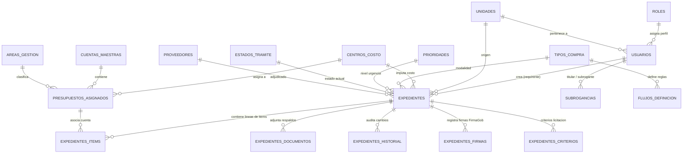
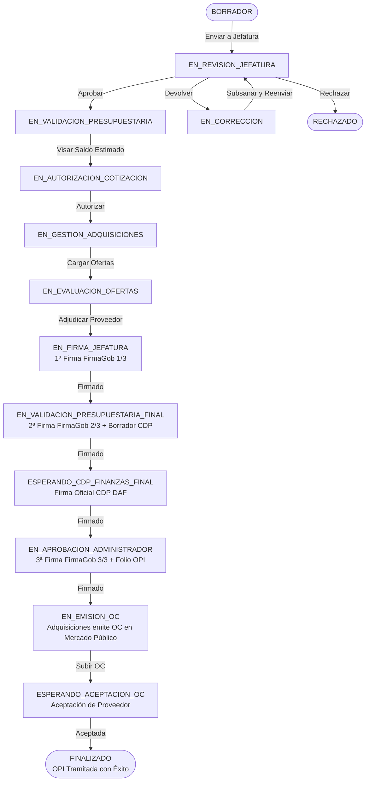

# Análisis Arquitectónico Integral, Flujos de Negocio y Roadmap Funcional
## Sistema de Órdenes de Pedido Interno (OPI v2) — Municipalidad de Lebu

---

## 1. Resumen Ejecutivo y Ficha Técnica

El **Sistema de Órdenes de Pedido Interno (OPI v2)** es una plataforma web desarrollada a la medida para la **Municipalidad de Lebu**, orientada a digitalizar, transparentar y estandarizar la totalidad del ciclo de compras públicas y abastecimiento municipal.

El sistema reemplaza los flujos en papel por un expediente electrónico auditable con validez legal, integrando **Firma Electrónica Avanzada (FirmaGob)** del Estado de Chile, autenticación unificada con **ClaveÚnica**, control de imputaciones presupuestarias en tiempo real y gestión por tipos de compra (Compra Ágil, Convenio Marco, Licitación Pública, Trato Directo y Contrato de Suministros).

```
+----------------------------------------------------------------------------------------------------+
|                                    SISTEMA OPI v2 - TECH STACK                                     |
+----------------------------------------------------------------------------------------------------+
| Backend:      PHP 8.x (Arquitectura Modular MVC nativa, PDO transaccional, Tipado estricto)        |
| Base de Datos: MySQL 8.x / MariaDB (InnoDB, Charset utf8mb4, Claves Foráneas con Integridad)        |
| Frontend:     HTML5 Semántico, Bootstrap 5.3, Bootstrap Icons, SaaS Design System (Inter CSS)      |
| Documentos:   FPDF / FPDI Engine (Generación y parseo de plantillas PDF para OPI y CDP)             |
| Integraciones:FirmaGob REST API v2 (SEGPRES), ClaveÚnica OIDC OAuth2, SMTP Socket Mailer            |
| Despliegue:   Docker Containerizado, Dockploy PaaS, Traefik Reverse Proxy con TLS automático       |
+----------------------------------------------------------------------------------------------------+
```

---

## 2. Mapa Arquitectónico y Estructura del Código

El proyecto sigue una arquitectura **MVC desacoplada** donde cada módulo de negocio se divide en su Controlador (`*_controller.php`) que maneja la lógica de validación, transacciones PDO y seguridad, y su Vista (`*.php`) que renderiza la interfaz visual bajo el sistema de diseño SaaS Minimalist.

```
opiv2/
│
├── 📁 css/
│   ├── saas-theme.css              # Sistema de Diseño Centralizado (Paleta SaaS, Inter, Tabular Nums)
│   └── style.css                   # Estilos heredados y clases auxiliares
│
├── 📁 components/
│   └── modal_firmagob.php          # Componente modal unificado para firma con FirmaGob / Token OTP
│
├── 📁 font/                        # Fuentes TrueType para generación de PDF con FPDF
├── 📁 sql/
│   └── database_produccion_limpia.sql # Script maestro DDL y datos semilla para producción
│
├── 📁 uploads/                     # Repositorio de expedientes organizados por año: /uploads/YYYY/exp_ID/
│
├── 📄 config.php                   # Conexión PDO, constantes de estado, CSRF token y configuraciones globales
├── 📄 head.php                     # Header HTML universal (meta, Google Fonts Inter, Bootstrap, saas-theme.css)
├── 📄 nav.php                      # Barra de navegación contextual por roles, indicador de subrogancia y trazabilidad
├── 📄 footer.php                   # Cierre de documentos HTML y scripts base
│
├── 📄 flujos_helper.php            # Motor central de la máquina de estados y transiciones dinámicas
├── 📄 firmagob_helper.php          # Integración FirmaGob (JWT HS256, layouts XML AgileSigner, API REST)
├── 📄 claveunica_helper.php        # Integración ClaveÚnica (OIDC, intercambio code->token, perfil userInfo)
├── 📄 mailer_helper.php            # Motor de correo electrónico HTML institucional vía SMTP Sockets
├── 📄 pdf_helper.php               # Motor generador de documentos OPI y CDP con soporte para sellos digitales
├── 📄 rut_helper.php               # Validación y formateo de RUTs chilenos
│
├── 📄 login.php                    # Portal de acceso dual (ClaveÚnica Oficial + Acceso Directo por RUN/Password)
├── 📄 claveunica_callback.php      # Receptor del callback OpenID Connect de ClaveÚnica
├── 📄 sysadmin_login.php           # Portal de acceso seguro para soporte y administración TI
├── 📄 registro.php                 # Registro de nuevos funcionarios con verificación por email
├── 📄 logout.php                   # Destrucción segura de sesión y redirección
│
├── 📄 dashboard.php / dashboard_controller.php               # Métricas ejecutivas, KPIs de montos y gráficos
├── 📄 mis_solicitudes.php / mis_solicitudes_controller.php   # Bandeja personal de requirentes con filtros y exportación
├── 📄 nueva_solicitud.php / nueva_solicitud_controller.php   # Asistente de creación de requerimientos y cálculo de IVA
├── 📄 editar_solicitud.php / editar_solicitud_controller.php # Edición y subsanación de observaciones en borradores
├── 📄 jefatura.php / jefatura_controller.php                 # Bandeja de revisión técnica, rechazo y 1ª Firma OPI
├── 📄 control_presupuestario.php / control_presupuestario_controller.php # V°B° presupuestario, imputación, 2ª Firma y CDP
├── 📄 finanzas.php / finanzas_controller.php                 # Bandeja de Dirección de Finanzas y Firma Oficial CDP
├── 📄 administrador.php / admin_controller.php               # Bandeja de Administrador Municipal, 3ª Firma y Folio OPI
├── 📄 adquisiciones.php / adquisiciones_controller.php       # Gestión de compras en Mercado Público y registro de OC
│
├── 📄 usuarios.php                 # Gestión de funcionarios, roles, asignación de jefaturas y activaciones
├── 📄 unidades.php                 # Árbol jerárquico de Direcciones, Departamentos y Unidades
├── 📄 centros_de_costo.php         # Mantenedor de Centros de Costo por año presupuestario
├── 📄 mantenedor_cuentas.php       # Catálogo de Cuentas Maestras e Imputaciones
├── 📄 mantenedor_flujos.php        # Diseñador dinámico de transiciones de estados por tipo de compra
├── 📄 firmantes.php                # Configuración de autoridades firmantes y delegaciones
├── 📄 subrogancia.php              # Configuración de suplencias temporales con vigencia de fechas
└── 📄 configuracion_sistema.php    # Parámetros del sistema (valor UTM, límites de adjuntos, modo mantenimiento)
```

---

## 3. Modelo de Datos y Entidades Principales

La base de datos está construida bajo motor **InnoDB** en **MySQL/MariaDB**, garantizando integridad referencial, transaccionalidad ACID y soporte completo de caracteres `utf8mb4`.



### Principales Tablas Transaccionales

| Tabla | Propósito | Llaves Foráneas Clave |
|---|---|---|
| `expedientes` | Registro maestro del requerimiento de compra, montos estimados/definitivos, folio OPI, número de OC, decreto, fechas de hito y estado actual. | `usuario_creador_id`, `unidad_origen_id`, `centro_costo_id`, `tipo_compra_id`, `proveedor_adjudicado_id`, `estado_actual`. |
| `expedientes_items` | Detalle itemizado de bienes o servicios solicitados (descripción, unidad, cantidad, precio unitario, catálogo CM). | `expediente_id`, `presupuesto_asignado_id`. |
| `expedientes_documentos` | Archivos adjuntos (especificaciones técnicas, cotizaciones, bases de licitación, acta de evaluación, CDP borrador, CDP firmado, OC). | `expediente_id`, `subido_por_id`. |
| `expedientes_firmas` | Pista de auditoría criptográfica de firmas FirmaGob: RUN, cargo, etapa (1/3, 2/3, 3/3, CDP), tokens, SHA256 checksums de entrada y salida. | `expediente_id`, `usuario_firmante_id`. |
| `expedientes_historial` | Bitácora inmutable de trazabilidad: quién, cuándo, acción realizada, estado origen, estado destino y motivo/observación. | `expediente_id`, `usuario_id`. |
| `flujos_definicion` | Motor dinámico de transiciones entre estados según tipo de compra, límites en UTM y obligatoriedad de comentarios o archivos. | `tipo_compra_id`, `estado_actual`, `estado_destino`. |
| `subrogancias` | Delegación temporal de roles entre funcionarios con rango de fechas (`fecha_inicio`, `fecha_fin`) y motivo. | `usuario_titular_id`, `usuario_subrogante_id`. |

---

## 4. Matriz de Roles, Permisos y Suplencias

El sistema cuenta con 7 perfiles de usuario que operan de manera complementaria en la cadena de abastecimiento:

```
+----------------------------------------------------------------------------------------------------+
|                                    MATRIZ DE ROLES Y RESPONSABILIDADES                             |
+--------------------+-------------------------------------------+-----------------------------------+
| Rol                | Responsabilidad Principal                 | Firmas y Acciones Críticas        |
+--------------------+-------------------------------------------+-----------------------------------+
| USUARIO_REQ        | Crear requerimientos, redactar items,    | Subir cotizaciones / bases.       |
| (Requirente)       | adjuntar archivos, evaluar ofertas.       | Adjudicar proveedor en compras.   |
+--------------------+-------------------------------------------+-----------------------------------+
| JEFE_UNIDAD        | Autorizar técnicamente la necesidad del   | 1ª Firma FirmaGob en OPI (1/3).   |
| (Jefatura)         | departamento y validar pertinencia.       | Devolver o rechazar solicitudes.  |
+--------------------+-------------------------------------------+-----------------------------------+
| PRESUPUESTO        | Verificar disponibilidad de fondos,       | 2ª Firma FirmaGob en OPI (2/3).   |
| (Control Presup.)  | imputar cuentas y emitir borrador de CDP. | Generar y adjuntar borrador CDP.  |
+--------------------+-------------------------------------------+-----------------------------------+
| FINANZAS           | Dirección de Finanzas (DAF). Emisión      | Firma Electrónica Oficial en CDP  |
| (DAF)              | oficial del Certificado de Disp. Presup.  | (Certificado de Disponibilidad).  |
+--------------------+-------------------------------------------+-----------------------------------+
| ADMIN_MUNICIPAL    | Máxima autoridad administrativa.          | 3ª Firma FirmaGob en OPI (3/3).   |
| (Administrador)    | Autorización final y asignación de folio. | Asigna Folio OPI Oficial.         |
+--------------------+-------------------------------------------+-----------------------------------+
| ADQUISICIONES      | Gestionar compras en Mercado Público,     | Publicar compras, subir ofertas,  |
| (Abastecimiento)   | licitaciones y emitir Orden de Compra.    | Cargar OC de Mercado Público.     |
+--------------------+-------------------------------------------+-----------------------------------+
| SYSADMIN           | Administración técnica, mantenedores,     | Configuración global, diseñador   |
| (Informática)      | auditoría de firmas y soporte TI.         | de flujos, usuarios y suplentes.  |
+--------------------+-------------------------------------------+-----------------------------------+
```

### Mecanismo de Subrogancia (Suplencia Activa)
Cuando un titular (por ejemplo, Director de Finanzas o Administrador Municipal) se encuentra en comisión de servicio o vacaciones, el sistema activa el modo suplente:
1. El suplente inicia sesión con su propia cuenta/ClaveÚnica.
2. El sistema detecta la subrogancia activa en `subrogancias` para la fecha actual.
3. Hereda los permisos del titular con un **badge visual de alerta ámbar** en la barra superior: `Suplente de: [Nombre Titular]`.
4. Todas las firmas y transiciones registran en auditoría: `Firmado por [Nombre Suplente] en calidad de suplente de [Nombre Titular]`.

---

## 5. Ciclo de Vida del Requerimiento (State Machine)

El flujo de compras municipal se compone de 13 estados progresivos y 3 estados terminales/excepcionales:



### La Cadena Criptográfica de Firmas (3/3)
1. **1ª Firma (Jefatura de Origen):** Da fe de la necesidad técnica de los bienes/servicios y ratifica el cuadro de evaluación de ofertas y proveedor seleccionado.
2. **2ª Firma (Control Presupuestario):** Da fe de la correcta imputación contable (Centro de Costo, Cuenta Maestra, Área de Gestión) y elabora el borrador del CDP.
3. **Firma CDP (Director de Finanzas DAF):** Emite con Firma Avanzada el Certificado de Disponibilidad Presupuestaria oficial que garantiza los fondos.
4. **3ª Firma (Administrador Municipal):** Autoriza el gasto municipal, asigna el Folio OPI definitivo y manda a Adquisiciones a emitir la Orden de Compra formal en Mercado Público.

---

## 6. Integraciones del Ecosistema Público

### 1. FirmaGob (Secretaría de Gobierno Digital - SEGPRES)
- **Generación de JWT:** Se construye un token HS256 con payload (`entity`, `run`, `purpose`, `expiration`) firmado con el secreto institucional.
- **Configuración XML AgileSigner:** Estampado visual de rúbrica digital según etapa (coordenadas calculadas en cuadrantes inferior izquierdo, central o derecho).
- **Consumo API REST:** Se envía el documento base64 al endpoint `/files/tickets` y se recibe el PDF sellado con certificado X.509 de Gobierno Digital.

### 2. ClaveÚnica (Gobierno Digital)
- **Protocolo OpenID Connect:** Flujo `Authorization Code` seguro de servidor a servidor vía cURL.
- **Validación de Identidad:** Recuperación de RUN, nombres y apellidos validados directamente contra el Servicio de Registro Civil e Identificación.

### 3. Motor de Notificaciones SMTP
- Sockets directos TLS/SSL con plantilla HTML municipal para avisos automáticos de traspaso de bandeja, devoluciones y asignación de folios.

---

## 7. Diagnóstico Técnico y Calidad de Código

### Fortalezas
- **Zero Dependencias Pesadas de Framework:** Rendimiento ultrarrápido, tiempo de carga menor a 150ms y facilidad de mantenimiento sin problemas de paquetes desactualizados.
- **Sistema de Diseño Consolidado:** 100% de los módulos principales migrados a la estética SaaS Minimalist con `css/saas-theme.css`.
- **Seguridad Robusta:** Tokens CSRF en cada formulario, validación de extensiones y tamaños de subida, PDO con sentencias preparadas y desinfección HTML.

### Puntos Identificados para Optimización
1. **Unificación de Paginación:** Algunos controladores cargaban el total de registros en memoria antes de paginar. Se aplicó guardas seguras (`$total_pages ?? 1`). Se recomienda estandarizar paginación SQL (`LIMIT/OFFSET`) en todos los listados.
2. **Gestión de Archivos Temporales:** Limpieza periódica automática de PDFs de trabajo tras ser sellados por FirmaGob.
3. **Centralización de Respuestas AJAX:** Estandarizar retornos JSON en endpoints de subida y trazabilidad.

---

## 8. Roadmap de Nuevas Opciones Funcionales y Módulos a Integrar

Para llevar a OPI v2 al siguiente nivel operativo, se propone el siguiente plan de expansión modular priorizado:

```
+----------------------------------------------------------------------------------------------------+
|                                    ROADMAP DE EXPANSIONES FUNCIONALES                              |
+-----+---------------------------------------------+----------+-------------------------------------+
| #   | Módulo / Funcionalidad                      | Prioridad| Impacto Operativo                   |
+-----+---------------------------------------------+----------+-------------------------------------+
| M1  | Línea de Tiempo Visual Interactiva          | ALTA     | Trazabilidad visual tipo Stepper con|
|     | (Auditoría Forense en Tiempo Real)          |          | tiempos de atención por etapa.      |
+-----+---------------------------------------------+----------+-------------------------------------+
| M2  | Semáforo de Control Presupuestario en Vivo  | ALTA     | Alerta visual de saldo consumido vs |
|     | (Detección de sobregiro por cuenta)         |          | saldo disponible en nueva solicitud.|
+-----+---------------------------------------------+----------+-------------------------------------+
| M3  | Descarga de Dossier en ZIP (1-Click)        | MEDIA    | Empaqueta OPI, CDP, cotizaciones,   |
|     |                                             |          | decreto y OC en un archivo único.   |
+-----+---------------------------------------------+----------+-------------------------------------+
| M4  | Módulo de Calificación de Proveedores       | MEDIA    | Scorecard de tiempos de entrega,    |
|     | (Historial de Cumplimiento / Desempeño)     |          | calidad del servicio y notas.       |
+-----+---------------------------------------------+----------+-------------------------------------+
| M5  | Exportador Avanzado e Informes Gerenciales  | ALTA     | Reportes en Excel (.xlsx) y PDF     |
|     |                                             |          | filtrados por Centro de Costo/Mes.  |
+-----+---------------------------------------------+----------+-------------------------------------+
| M6  | Integración API / Webhook Mercado Público   | MEDIA    | Consulta y sincronización directa   |
|     |                                             |          | del estado de órdenes de compra.    |
+-----+---------------------------------------------+----------+-------------------------------------+
| M7  | Módulo de Recepción Conforme y Bodega       | MEDIA    | Acta de recepción técnica, ingreso  |
|     |                                             |          | a bodega y vinculación con factura. |
+-----+---------------------------------------------+----------+-------------------------------------+
| M8  | Centro de Notificaciones In-App             | BAJA     | Campana superior con alertas en     |
|     | (Campana de Notificaciones en Vivo)         |          | tiempo real de solicitudes urgentes.|
+-----+---------------------------------------------+----------+-------------------------------------+
```

### Detalle de Módulos Prioritarios a Implementar

#### 🌟 Módulo 1: Línea de Tiempo Visual Interactiva (Timeline Stepper)
- Reemplaza el modal simple por un componente visual que muestra cada hito cronológico con fecha, hora, responsable y tiempo transcurrido (ej: "Estuvo 4 horas en Jefatura").
- Indicador de cuello de botella: resalta en color naranja o rojo las etapas que han excedido el tiempo promedio de tramitación.

#### 🌟 Módulo 2: Semáforo y Alerta de Saldo Presupuestario en Tiempo Real
- En `nueva_solicitud.php` y `control_presupuestario.php`, al seleccionar un Centro de Costo y Cuenta Maestra, consultar vía AJAX el presupuesto asignado, el monto comprometido en OPIs previas y el saldo remanente.
- Si el monto solicitado supera el disponible, emite una advertencia visual preventiva antes de enviar a firma.

#### 🌟 Módulo 3: Descargador de Expediente Completo en ZIP (Dossier Único)
- Endpoint `descargar_expediente_zip.php?id=XXX` que compila en memoria la OPI oficial firmada, el CDP firmado, las cotizaciones, bases técnicas, acta de adjudicación y copia de la OC de Mercado Público.
- Facilita auditorías de Contraloría General de la República (CGR) y revisiones de Control Interno.

#### 🌟 Módulo 5: Motor de Reportabilidad y Estadísticas (Excel / PDF)
- Exportador de datos tabulares a Excel nativo (formateado con estilos, montos numéricos y totales) y PDF ejecutivo con gráficos de distribución del gasto por Dirección, Centro de Costo y Proveedor adjudicado.

---

## 9. Conclusión

El sistema **OPI v2** cuenta con una base arquitectónica sólida, moderna y segura, completamente adaptada a la normativa de transformación digital del Estado de Chile. Con el sistema de diseño SaaS Minimalist unificado y la cadena de firma digital operativa, la plataforma está lista para recibir las extensiones funcionales del roadmap propuesto.
